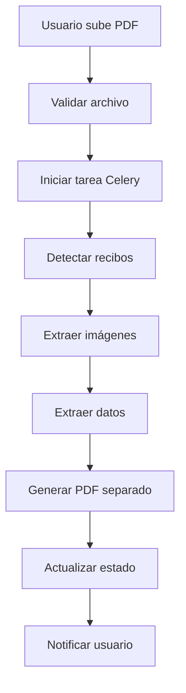

# Separador de Recibos PDF

Una aplicación web completa desarrollada en Django para separar automáticamente recibos bancarios de archivos PDF, extraer imágenes de cada recibo y generar PDFs individuales, además de crear una tabla completa para seguimiento de todos los datos.

## 🚀 Características Principales

### 📊 Funcionalidades Core
- **Detección Automática**: Identifica automáticamente recibos usando el texto "Recibo individual de pagos"
- **Extracción Visual**: Captura la imagen de cada recibo como screenshot de alta calidad
- **Separación Inteligente**: Genera PDF separado con cada recibo en su propia página
- **Tabla de Seguimiento**: Almacena y permite consultar todos los datos extraídos
- **Procesamiento Asíncrono**: Maneja archivos grandes sin bloquear la interfaz

### 🎯 Funcionalidades Adicionales
- **Dashboard Completo**: Estadísticas y resumen de procesamientos
- **Filtros Avanzados**: Búsqueda por beneficiario, entidad, valor, fecha
- **Validación Manual**: Permite validar o corregir datos extraídos
- **Exportación**: Descarga de datos en formato CSV
- **Múltiples Vistas**: Tabla y galería de tarjetas para los recibos
- **Responsive**: Interfaz adaptable a dispositivos móviles

## 🏗️ Arquitectura

### Tecnologías Utilizadas
- **Backend**: Django 5.2.0
- **Procesamiento PDF**: PyPDF2, pdfplumber, PyMuPDF
- **Generación PDF**: reportlab
- **Procesamiento Asíncrono**: Celery + Redis
- **Frontend**: Bootstrap 5, Font Awesome
- **Base de Datos**: SQLite3 (desarrollo) / PostgreSQL (producción)

### Estructura del Proyecto
```
separador_recibos/
├── models.py              # Modelos de base de datos
├── views.py               # Vistas principales
├── urls.py                # Configuración de URLs
├── forms.py               # Formularios Django
├── tasks.py               # Tareas Celery
├── admin.py               # Configuración admin
├── utils/                 # Utilidades de procesamiento
│   ├── pdf_processor.py   # Detección de recibos
│   ├── image_extractor.py # Extracción de imágenes
│   └── pdf_generator.py   # Generación de PDFs
├── templates/             # Templates HTML
└── migrations/            # Migraciones de BD
```

## 📋 Modelos de Base de Datos

### ProcesamientoRecibo
- **ID único**: UUID para identificar cada procesamiento
- **Archivo original**: PDF subido por el usuario
- **Estado**: PENDIENTE, PROCESANDO, COMPLETADO, ERROR
- **Archivo resultado**: PDF separado generado
- **Total recibos**: Cantidad de recibos detectados

### ReciboDetectado
- **Información extraída**: Beneficiario, valor, entidad, cuenta, referencia
- **Coordenadas**: Posición exacta del recibo en el PDF original
- **Imagen**: Screenshot del recibo extraído
- **Validación**: Campo para marcar como validado

## ⚙️ Instalación y Configuración

### 1. Requisitos Previos
```bash
Python 3.8+
PostgreSQL (opcional para producción)
Redis (para Celery)
```

### 2. Instalación de Dependencias
```bash
pip install -r requirements.txt
```

### 3. Configuración de Base de Datos
```bash
python manage.py makemigrations separador_recibos
python manage.py migrate
python manage.py createsuperuser
```

### 4. Configuración de Celery (Opcional)
```bash
# Iniciar worker de Celery
celery -A contabiliadad worker -l info

# Iniciar Redis
redis-server
```

### 5. Ejecutar Aplicación
```bash
python manage.py runserver
```

## 🔧 Uso de la Aplicación

### 1. Acceder a la Aplicación
- URL: `http://localhost:8000/separador/`
- Dashboard: `http://localhost:8000/separador/dashboard/`

### 2. Subir PDF
1. Ir a "Subir PDF"
2. Seleccionar archivo PDF (máximo 50MB)
3. Configurar opciones de procesamiento
4. Enviar formulario

### 3. Monitorear Procesamiento
- Ver estado en tiempo real
- Actualización automática cada 5 segundos
- Vista previa de recibos detectados

### 4. Revisar Resultados
- Galería de recibos con imágenes
- Tabla completa con todos los datos
- Estadísticas del procesamiento

### 5. Gestionar Recibos
- Ver detalles de cada recibo
- Editar información extraída
- Validar o invalidar recibos
- Descargar imágenes individuales

## 🎯 Algoritmo de Detección

### Proceso de Detección
1. **Análisis de Texto**: Busca patrones "Recibo individual de pagos"
2. **Cálculo de Coordenadas**: Determina posición exacta en el PDF
3. **Extracción de Área**: Define límites del recibo completo
4. **Captura de Imagen**: Genera screenshot de alta calidad
5. **Extracción de Datos**: Parsea información específica (beneficiario, valor, etc.)

### Extracción de Datos
- **Beneficiario**: Busca texto después de "Nombre de beneficiario"
- **Valor**: Extrae números después de "Valor:"
- **Entidad**: Identifica nombre del banco
- **Cuenta**: Número de cuenta del beneficiario
- **Referencia**: Código de referencia de la transacción

## 📱 Interfaz de Usuario

### Dashboard
- **Estadísticas**: Total procesamientos, recibos, valor
- **Procesamientos recientes**: Lista de últimos archivos procesados
- **Top entidades**: Distribución por bancos
- **Acciones rápidas**: Acceso directo a funciones principales

### Tabla de Recibos
- **Vista de tabla**: Listado detallado con filtros
- **Vista de tarjetas**: Galería visual de recibos
- **Filtros avanzados**: Por beneficiario, entidad, valor, fecha
- **Paginación**: Para manejar grandes volúmenes de datos

### Subida de PDF
- **Drag & Drop**: Arrastrar y soltar archivos
- **Validación**: Verificación de tipo y tamaño
- **Preview**: Vista previa del archivo seleccionado
- **Configuración**: Opciones de procesamiento

## 🔄 Flujo de Procesamiento



## 🛠️ Configuración Avanzada

### Settings.py
```python
# Configuración de Celery
CELERY_BROKER_URL = 'redis://localhost:6379/0'
CELERY_RESULT_BACKEND = 'redis://localhost:6379/0'

# Configuración de archivos
MEDIA_URL = '/media/'
MEDIA_ROOT = BASE_DIR / 'media'

# Logging
LOGGING = {
    'loggers': {
        'separador_recibos': {
            'handlers': ['file', 'console'],
            'level': 'INFO',
        },
    },
}
```

### Optimización
- **Índices de BD**: Para búsquedas rápidas
- **Cache**: Almacenamiento de imágenes procesadas
- **Compresión**: Reducción de tamaño de archivos
- **CDN**: Para servir archivos estáticos

## 📊 Métricas y Monitoreo

### Métricas Disponibles
- **Tiempo de procesamiento**: Por archivo y por recibo
- **Precisión de extracción**: % de datos correctos
- **Uso de recursos**: CPU, memoria, almacenamiento
- **Errores**: Log de fallos y excepciones

### Logs
- **Archivo de log**: `separador_recibos.log`
- **Niveles**: INFO, WARNING, ERROR
- **Rotación**: Automática por tamaño

## 🔒 Seguridad

### Medidas Implementadas
- **Autenticación**: Login requerido para todas las funciones
- **Autorización**: Acceso limitado a propios archivos
- **Validación**: Verificación de archivos subidos
- **Sanitización**: Limpieza de inputs del usuario

### Recomendaciones
- **HTTPS**: En producción
- **Backup**: Respaldo regular de base de datos
- **Monitoreo**: Alertas de seguridad
- **Actualizaciones**: Parches regulares

## 🧪 Testing

### Tests Incluidos
- **Unitarios**: Funciones de procesamiento PDF
- **Integración**: Flujo completo de subida
- **UI**: Interfaz de usuario
- **Performance**: Carga de archivos grandes

### Ejecutar Tests
```bash
python manage.py test separador_recibos
```

## 🚀 Despliegue

### Producción
1. **Servidor Web**: Nginx + Gunicorn
2. **Base de Datos**: PostgreSQL
3. **Cache**: Redis
4. **Workers**: Múltiples workers de Celery
5. **Monitoreo**: Sentry, New Relic

### Docker (Opcional)
```dockerfile
FROM python:3.9
COPY requirements.txt .
RUN pip install -r requirements.txt
# ... resto de configuración
```

## 📚 API REST (Futuro)

### Endpoints Planeados
```
GET    /api/procesamientos/          # Lista procesamientos
POST   /api/procesamientos/          # Crear procesamiento
GET    /api/procesamientos/{id}/     # Detalle procesamiento
GET    /api/recibos/                 # Lista recibos
GET    /api/recibos/{id}/            # Detalle recibo
PUT    /api/recibos/{id}/            # Actualizar recibo
```

## 🤝 Contribución

### Guías de Desarrollo
1. **Código limpio**: PEP 8, type hints
2. **Documentación**: Docstrings en español
3. **Tests**: Cobertura mínima 80%
4. **Branches**: feature/ para nuevas funcionalidades

### Proceso
1. Fork del repositorio
2. Crear branch feature/
3. Commit con mensajes descriptivos
4. Crear pull request
5. Review y merge

## 📄 Licencia

MIT License - Ver archivo LICENSE para detalles

## 👥 Soporte

### Contacto
- **Email**: soporte@separadorrecibos.com
- **Issues**: GitHub Issues
- **Documentación**: Wiki del proyecto

### FAQ
**P: ¿Qué formatos de PDF soporta?**
R: Cualquier PDF con texto "Recibo individual de pagos"

**P: ¿Hay límite de tamaño de archivo?**
R: 50MB por archivo PDF

**P: ¿Funciona sin Celery?**
R: Sí, pero el procesamiento será síncrono

**P: ¿Se puede personalizar el algoritmo de detección?**
R: Sí, modificar `utils/pdf_processor.py`

---

**Versión**: 1.0.0  
**Fecha**: Noviembre 2024  
**Autor**: Sistema de Contabilidad CHVS